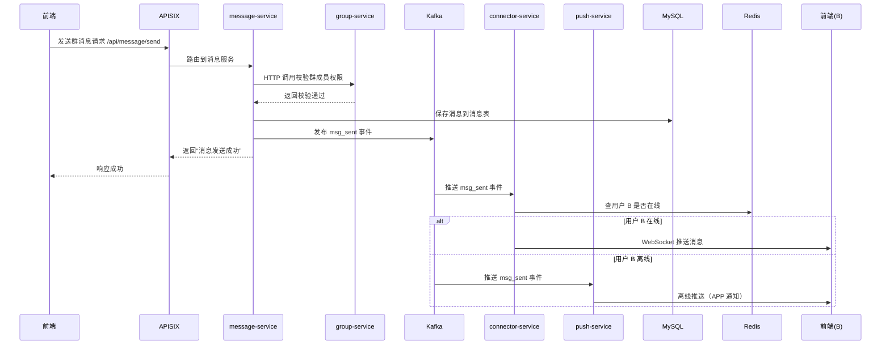

# IM 微服务架构设计：从拆分到治理

把 IM 系统拆分为微服务是典型的“高内聚、低耦合”架构设计，核心是**按业务域拆分服务**，再通过「中间件+服务治理」实现协同，我结合之前聊的技术栈（FastAPI/Kafka/Redis/MySQL/Nacos/APISIX），给你梳理 **IM 微服务化的完整落地步骤**，从拆分原则到部署运行，一步到位。

### 一、第一步：明确 IM 微服务拆分原则（核心）

拆分的核心是「一个服务只做一件事」，按 **业务域+数据归属** 拆分，避免“大杂烩”：

|拆分原则|具体说明|
|---|---|
|业务域隔离|比如“用户管理”“消息收发”“群组管理”是不同业务域，拆成独立服务|
|数据自治|每个服务管理自己的数据库/表，不跨服务直接操作其他服务的数据库|
|轻通信|服务间只通过 HTTP/gRPC（同步）或 Kafka（异步）通信，不直接依赖|
|无状态|服务本身不存状态（比如用户登录态放 Redis），方便扩缩容|
### 二、第二步：IM 核心微服务拆分（必拆的 6 个核心服务）

结合 IM 核心场景（登录、发消息、群聊、推送、文件、长连接），拆分出以下服务（按优先级排序）：

|服务名称|核心职责|依赖组件|对外接口（HTTP/gRPC）|异步事件（Kafka）|
|---|---|---|---|---|
|**user-service（用户服务）**|用户注册/登录/资料管理、token 校验|MySQL（用户表）、Redis（登录态）|`/api/user/register` `/api/user/login` `/api/user/info`|发布：`user_registered` `user_info_updated` 消费：无|
|**group-service（群组服务）**|群创建/解散、成员管理、权限校验|MySQL（群表/成员表）|`/api/group/create` `/api/group/add-member` `/api/group/check-perm`|发布：`group_created` `member_changed` 消费：无|
|**message-service（消息服务）**|消息收发、内容校验、历史存储|MySQL（消息表）、Kafka（消息队列）|`/api/message/send` `/api/message/history`|发布：`msg_sent` `msg_read` 消费：无|
|**connector-service（长连接服务）**|WebSocket 长连接维护、实时推送消息|Redis（在线状态）、Kafka（消费消息）|WebSocket 连接 `/ws/connect`|消费：`msg_sent`（推送给在线用户） 发布：`user_online` `user_offline`|
|**push-service（推送服务）**|离线消息推送（APP/短信）|Kafka（消费离线消息）|无（内部服务）|消费：`msg_sent`（检测用户离线则推送） 发布：`push_success`|
|**storage-service（存储服务）**|图片/文件/语音上传、转码、下载|MySQL（文件元信息）、对象存储（如 MinIO）|`/api/storage/upload` `/api/storage/download`|发布：`file_uploaded` 消费：无|
### 三、第三步：微服务间的通信方式（同步+异步）

服务间不直接调用数据库，而是通过以下方式协同：

#### 1. 同步通信（需要即时结果）：HTTP/gRPC

适用于“校验权限、查询数据”等场景，比如：

- `message-service` 发群消息前，**HTTP 调用 ** **`group-service`** 校验“用户是否是群成员、是否被禁言”；

- `connector-service` 建立连接时，**HTTP 调用 ** **`user-service`** 校验用户 token 是否有效；

- 推荐用 FastAPI 写接口，简单易上手，生产环境可替换为 gRPC（性能更高）。

#### 2. 异步通信（不需要即时结果）：Kafka

适用于“消息分发、事件通知”等场景，核心是「生产者发消息，消费者处理」：

- `message-service` 收到用户消息后，**往 Kafka 的 ** **`msg_sent`** ** 主题发消息**；

- `connector-service` 消费 `msg_sent` → 推送给在线用户；

- `push-service` 消费 `msg_sent` → 检测用户离线则发推送；

- `message-service` 无需等待推送完成，丢到 Kafka 就返回，提升接口响应速度。

### 四、第四步：核心中间件的作用（微服务的“基础设施”）

|中间件|核心作用|具体用法|
|---|---|---|
|**MySQL**|存储结构化数据|每个服务独立库/表（比如 user-service 用 `im_user` 库，message-service 用 `im_message` 库）|
|**Redis**|缓存/临时状态|存储登录 token、用户在线状态、未读消息数、群成员缓存|
|**Kafka**|异步事件总线|消息分发、服务解耦、削峰填谷（比如百万人群消息分发）|
|**Nacos**|配置中心+服务注册发现|1. 配置中心：所有服务的数据库/Redis/Kafka 地址存在 Nacos，动态更新； 2. 服务注册：每个服务启动后注册到 Nacos，调用时从 Nacos 查地址（无需硬编码 IP）|
|**APISIX**|网关/路由/负载均衡|1. 所有前端请求先过 APISIX，路由到对应服务（比如 `/api/user/*` 路由到 `user-service`）； 2. 统一鉴权、限流、日志、跨域； 3. 负载均衡（比如 `message-service` 多实例时，APISIX 分发请求）|
### 五、第五步：微服务部署与运行（从开发到生产）

#### 1. 本地开发（Docker Compose）

- 每个服务写自己的 `Dockerfile`（基于 Python 3.14，FastAPI 启动）；

- 写 `docker-compose.yml`，一键启动所有服务+中间件（MySQL/Redis/Kafka/Nacos/APISIX）；

- 服务间通过 Docker 内置 DNS 通信（比如 `user-service:8000`），无需硬编码 IP。

#### 2. 生产环境（K8s）

- 每个服务打包成 Docker 镜像，推到私有镜像仓库；

- 写 K8s 的 `Deployment` 配置（指定镜像、资源限制、副本数），`Service` 配置（暴露端口）；

- 通过 Nacos 做服务注册发现，APISIX 做网关入口；

- 中间件（MySQL/Redis/Kafka）用云托管或 K8s 集群部署，保证高可用。

### 六、第六步：核心流程示例（用户 A 发群消息给用户 B）

用一个完整流程串起所有服务，理解微服务协同：

### 总结

IM 微服务化的核心可以总结为 3 点：

1. **拆分**：按业务域拆成独立服务（用户/消息/群组/推送等），数据自治；

2. **通信**：同步用 HTTP/gRPC 做权限校验/查询，异步用 Kafka 做消息分发/事件通知；

3. **治理**：用 Nacos 做配置/服务发现，APISIX 做网关，Redis/MySQL 做数据存储，K8s 做部署扩缩容。

这种架构的优势是：单个服务故障不影响整体、可针对高并发服务（如 connector-service）单独扩缩容、迭代时只需改对应服务，符合大型 IM 系统的演进需求。
> （注：文档部分内容可能由 AI 生成）