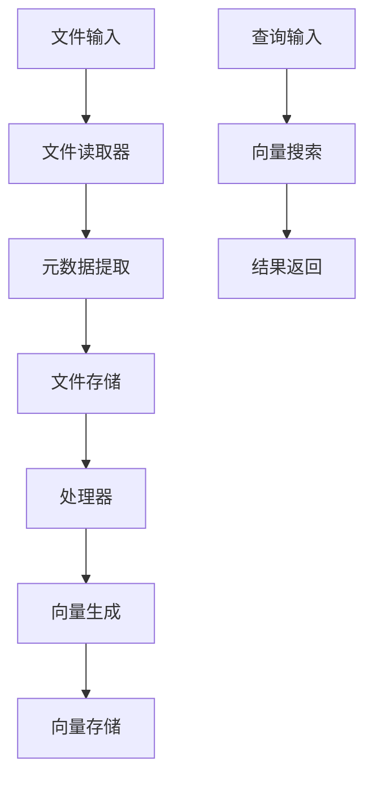
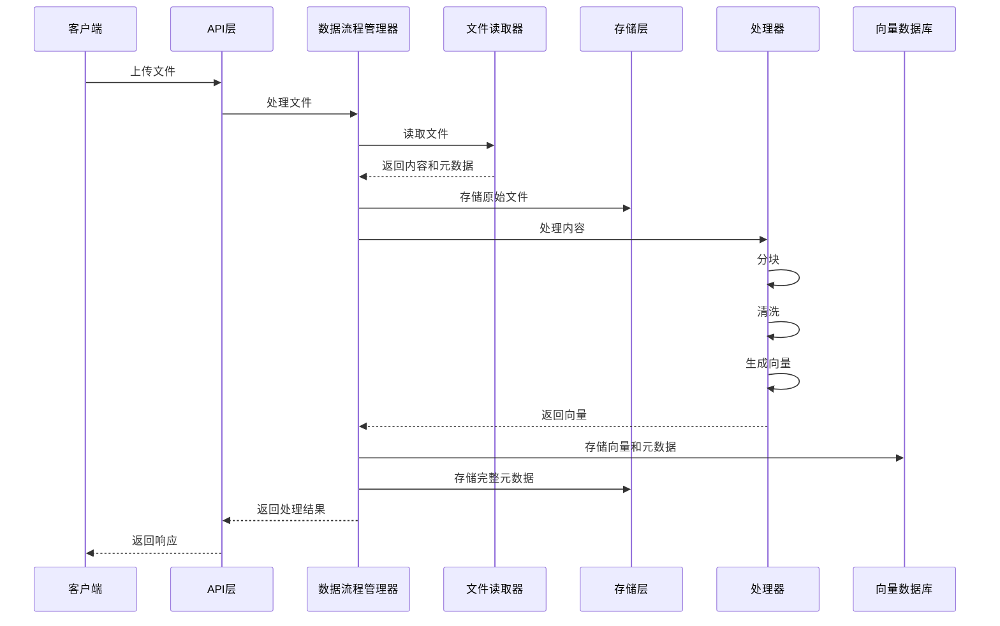
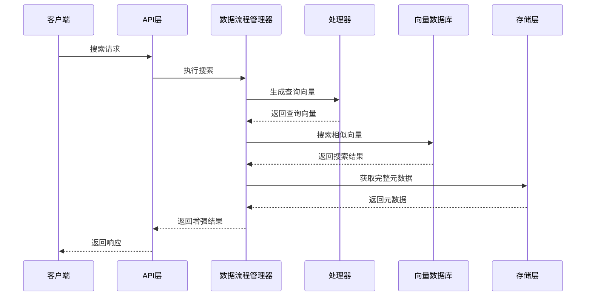
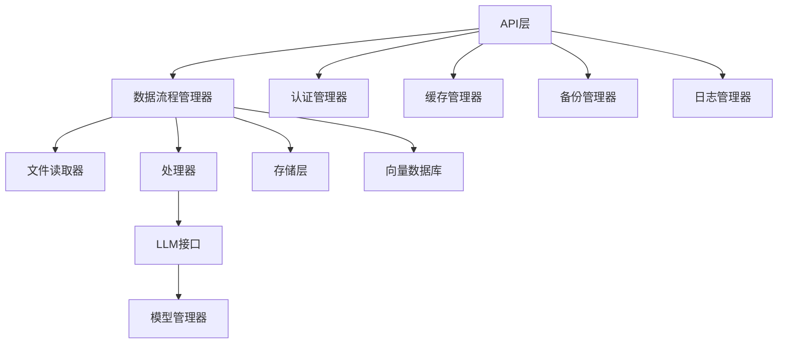

# 向量数据库架构设计文档

## 1. 架构概述

本项目采用模块化、分层架构设计，旨在构建一个高效的向量相似度搜索引擎和向量数据库系统。系统由多个核心模块组成，每个模块都有明确的职责和接口，便于扩展和维护。

### 1.1 设计原则

- **模块化设计**：将系统分解为独立的模块，每个模块负责特定的功能
- **接口分离**：通过接口定义模块间的交互，实现松耦合
- **可扩展性**：支持多种后端实现，可根据需求灵活切换
- **性能优化**：针对向量存储和检索进行性能优化
- **安全性**：集成认证、授权和加密机制

## 2. 核心组件

### 2.1 数据流程层

**DataFlowManager** 是系统的核心协调器，负责编排整个数据处理流程：

**主要功能**：
- 初始化和管理各个模块的实例
- 协调文件处理流程
- 管理向量检索流程
- 处理错误和异常情况

### 2.2 文件处理层

#### 2.2.1 文件读取器

**BaseDocumentReader**（基类）：
- 方法：`read()`, `extract_metadata()`, `get_content()`
- 属性：`file_path`, `file_type`, `metadata`

**子类实现**：
- `TextDocumentReader`：处理文本文件（txt, md, docx, pdf等）
- `ImageDocumentReader`：处理图像文件（jpg, png, bmp等）
- `VideoDocumentReader`：处理视频文件（mp4, avi, mov等）
- `AudioDocumentReader`：处理音频文件（mp3, wav等）

#### 2.2.2 处理器

**BaseProcessor**（基类）：
- 方法：`chunk()`, `clean()`, `embed()`

**子类实现**：
- `TextProcessor`：文本分词、清洗、嵌入
- `ImageProcessor`：图像特征提取、嵌入
- `VideoProcessor`：视频帧提取、特征嵌入
- `AudioProcessor`：音频特征提取、嵌入

### 2.3 存储层

#### 2.3.1 文件存储

**FileStorageInterface**（接口）：
- 方法：`store_file()`, `get_file()`, `delete_file()`, `list_files()`

**实现**：
- `LocalFileSystemStorage`：本地文件系统存储
- `ObjectStorage`：S3对象存储
- `DatabaseStorage`：数据库存储
- `_InMemoryFileStorage`：内存存储（测试用）

#### 2.3.2 元数据存储

**MetadataStorageInterface**（接口）：
- 方法：`store_metadata()`, `get_metadata()`, `update_metadata()`, `delete_metadata()`, `search_metadata()`

**实现**：
- `MySQLStorage`：MySQL存储
- `RedisStorage`：Redis存储
- `MongoDBStorage`：MongoDB存储
- `_InMemoryMetadataStorage`：内存存储（测试用）

### 2.4 向量数据库层

**BaseVectorDB**（基类）：
- 方法：`create_collection()`, `insert()`, `search()`, `delete()`, `modify()`

**实现**：
- `FAISSVectorDB`：基于FAISS库的实现
- `HNSWVectorDB`：基于HNSW算法的实现
- `AnnoyVectorDB`：基于Annoy算法的实现

### 2.5 LLM接口层

**LLMInterface**（接口）：
- 方法：`generate()`, `embed()`

**实现**：
- `LocalLLM`：本地模型调用
- `RemoteLLM`：远程API调用（OpenAI兼容）

### 2.6 系统服务层

#### 2.6.1 模型管理器

**ModelManager**：
- 功能：管理模型的下载、缓存和生命周期
- 特性：支持国内镜像、自动模型下载

#### 2.6.2 缓存管理器

**CacheManager**：
- 功能：提供内存和Redis缓存
- 特性：支持跨进程共享缓存

#### 2.6.3 认证管理器

**AuthManager**：
- 功能：API Key和JWT认证
- 特性：支持基于角色的权限管理

#### 2.6.4 备份管理器

**BackupManager**：
- 功能：数据备份和恢复
- 特性：支持自动备份和手动备份

#### 2.6.5 日志管理器

**LogManager**：
- 功能：系统日志记录
- 特性：支持不同级别的日志

## 3. 数据流程

### 3.1 文件处理流程

### 3.2 向量检索流程

## 4. 系统架构

### 4.1 模块依赖关系

### 4.2 多进程架构

**支持的部署模式**：
- **单进程模式**：适用于开发和小型部署
- **多进程模式**：适用于生产环境，支持水平扩展

**多进程安全措施**：
- **FAISS文件锁**：使用filelock确保多进程安全
- **Redis共享缓存**：跨进程共享缓存数据
- **Redis速率限制**：跨进程共享速率限制计数器

### 4.3 配置管理

**配置系统**：
- 使用.env文件管理配置
- 支持环境变量覆盖
- 提供合理的默认值

**主要配置项**：
- 向量数据库类型和路径
- 元数据存储类型和连接信息
- 文件存储类型和配置
- 模型配置（本地/远程）
- 缓存配置
- 安全配置

## 5. 技术栈

| 类别 | 技术 | 版本 | 用途 |
|------|------|------|------|
| 编程语言 | Python | 3.8+ | 核心开发语言 |
| Web框架 | FastAPI | 0.104+ | API接口 |
| 服务器 | uvicorn | 0.24+ | ASGI服务器 |
| 向量数据库 | FAISS | 1.7+ | 向量存储和检索 |
| 向量数据库 | HNSWlib | 0.7+ | 向量存储和检索 |
| 向量数据库 | Annoy | 1.17+ | 向量存储和检索 |
| 文本处理 | sentence-transformers | 2.2+ | 文本嵌入 |
| 图像处理 | transformers | 4.35+ | 图像嵌入 |
| 视频处理 | OpenCV | 4.8+ | 视频帧提取 |
| 音频处理 | librosa | 0.10+ | 音频特征提取 |
| 元数据存储 | MySQL | 8.0+ | 元数据存储 |
| 元数据存储 | Redis | 7.0+ | 元数据存储和缓存 |
| 元数据存储 | MongoDB | 6.0+ | 元数据存储 |
| 缓存 | Redis | 7.0+ | 跨进程缓存 |
| 认证 | PyJWT | 2.6+ | JWT认证 |
| 加密 | cryptography | 41.0+ | 数据加密 |
| 速率限制 | slowapi | 0.1.9+ | API速率限制 |
| 并发安全 | filelock | 3.13+ | 文件锁 |
| 容器化 | Docker | 20.10+ | 容器化部署 |

## 6. 性能优化

### 6.1 向量存储优化

- **索引结构**：根据数据量选择合适的索引类型
- **批量插入**：支持批量向量插入，减少IO操作
- **内存管理**：优化内存使用，避免内存泄漏

### 6.2 检索优化

- **缓存策略**：缓存热点查询结果
- **过滤优化**：在检索后进行元数据过滤，减少计算量
- **并行处理**：使用多进程处理批量请求

### 6.3 数据处理优化

- **分块策略**：根据文件类型和大小选择合适的分块策略
- **并行处理**：使用多线程处理文件分块
- **模型优化**：选择合适的模型平衡性能和准确性

## 7. 安全设计

### 7.1 认证与授权

- **API Key认证**：用于服务间调用
- **JWT认证**：用于用户认证
- **基于角色的权限管理**：控制不同用户的访问权限

### 7.2 数据安全

- **敏感数据加密**：使用AES-256加密存储敏感数据
- **API请求验证**：验证请求参数的合法性
- **防止路径遍历**：安全处理文件路径

### 7.3 速率限制

- **基于IP的速率限制**：防止API滥用
- **基于用户的速率限制**：控制单个用户的请求频率

## 8. 扩展性设计

### 8.1 插件系统

- **存储后端插件**：支持自定义存储后端
- **处理器插件**：支持自定义处理器
- **向量数据库插件**：支持自定义向量数据库实现

### 8.2 API扩展

- **RESTful API**：标准HTTP接口
- **gRPC支持**：高性能RPC接口（待实现）

### 8.3 模型扩展

- **本地模型**：支持自定义本地模型
- **远程模型**：支持自定义远程API

## 9. 部署架构

### 9.1 开发环境

- **本地开发**：直接运行Python代码
- **测试模式**：跳过真实模型加载，使用模拟数据

### 9.2 生产环境

- **容器化部署**：使用Docker容器
- **多进程部署**：使用uvicorn多进程模式
- **负载均衡**：使用Nginx等进行负载均衡（外部）

### 9.3 监控与日志

- **系统状态监控**：通过API接口获取系统状态
- **日志管理**：集中式日志管理（待实现）
- **健康检查**：系统健康状态检查（待实现）

## 10. 架构决策记录

### 10.1 向量数据库选择

- **决策**：支持多种向量数据库后端（FAISS、HNSW、Annoy）
- **理由**：不同场景下对性能和功能的需求不同，提供多种选择可以满足不同需求
- **影响**：增加了代码复杂度，但提高了系统的灵活性

### 10.2 存储架构

- **决策**：分离文件存储、元数据存储和向量存储
- **理由**：不同类型的数据有不同的存储需求，分离存储可以优化性能和成本
- **影响**：增加了系统复杂度，但提高了存储效率和灵活性

### 10.3 多进程支持

- **决策**：支持多进程部署，使用Redis共享状态
- **理由**：提高系统吞吐量和可靠性
- **影响**：增加了系统复杂度，需要处理并发安全问题

### 10.4 模型管理

- **决策**：支持本地和远程模型，自动下载本地模型
- **理由**：提供灵活性，满足不同场景的需求
- **影响**：增加了模型管理的复杂度，但提高了系统的适应性

## 11. 未来架构演进

### 11.1 分布式向量数据库

- **目标**：支持分布式向量数据库集群
- **挑战**：数据一致性、负载均衡、故障恢复
- **实现路径**：基于现有架构扩展，增加分布式协调机制

### 11.2 实时处理

- **目标**：支持实时数据流处理
- **挑战**：低延迟处理、资源管理
- **实现路径**：引入流处理框架，优化处理流程

### 11.3 智能缓存

- **目标**：实现智能缓存策略，提高缓存命中率
- **挑战**：缓存策略设计、内存管理
- **实现路径**：基于机器学习的缓存预测，动态调整缓存策略

### 11.4 自动化运维

- **目标**：实现自动化部署、监控和故障恢复
- **挑战**：系统复杂度、可靠性
- **实现路径**：引入DevOps工具链，实现自动化运维流程

## 12. 结论

本架构设计采用模块化、分层的设计理念，通过接口分离和多实现支持，提供了一个灵活、可扩展的向量数据库系统。系统支持多种文件类型处理、多种向量数据库后端、多种存储方式，满足不同场景的需求。同时，通过性能优化和安全设计，确保系统的高效性和安全性。

未来，系统可以通过分布式扩展、实时处理、智能缓存和自动化运维等方向进一步演进，以满足更复杂的应用场景需求。